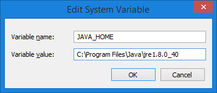
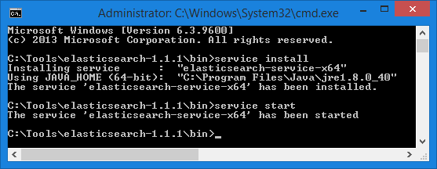

---
title: Deploy Elasticsearch to dedicated server
description: The article about deploying Elasticsearch to a dedicated server
layout: docs
date: 2016-07-07T14:37:03.120Z
priority: 1
---
## Setup Java

Download and install <a href="http://java.com/download/" rel="nofollow">Java</a>.

Create a system environment variable **JAVA_HOME** and enter the path to Java folder as its value: 


## Setup Elasticsearch

Download <a href="https://download.elastic.co/elasticsearch/elasticsearch/elasticsearch-1.7.5.zip" rel="nofollow">Elasticsearch 1.7.5</a>.

Extract all files.

Run command promt as administrator and change current directory to **\bin**.

Register and start Elasticsearch as Windows service by running the following commands:

```
service install
service start
```



Navigate toВ **http://localhost:9200**В in your browser. You should see Elasticsearch status inВ JSON format:

```
{
  "status" : 200,
  "name" : "Aireo",
  "version" : {
    "number" : "1.1.1",
    "build_hash" : "f1585f096d3f3985e73456debdc1a0745f512bbc",
    "build_timestamp" : "2014-04-16T14:27:12Z",
    "build_snapshot" : false,
    "lucene_version" : "4.7"
  },
  "tagline" : "You Know, for Search"
}
```

If you wish Elasticsearch to start when Windows starts run the following command in the same command prompt:

```
sc config elasticsearch-service-x64 start=auto
```

whereВ elasticsearch-service-x64 is the name of the installed Elasticsearch service.
