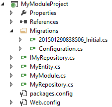

---
title: Managing Module Database
description: This tutorialВ will show you how to integrate your module into database creation and update process
layout: docs
date: 2016-06-10T15:02:35.287Z
priority: 2
---
## Summary

This tutorialВ will show you how to integrate your module into database creation and update process.

## Overview

When application starts it calls the **IModule.SetupDatabase** method for each module where the moduleВ can create or update tables and fill them with data.

Database objects should be created using Entity Framework [Code First Migrations](https://msdn.microsoft.com/en-us/data/jj591621).

## Model and repository

Consider a projectВ **MyModuleProject**В withВ **MyEntity**В class, which represents a model to be persisted in database.

```
public class MyEntity
{
  public int Id { get; set; }
  public string Title { get; set; }
}
```

Add NuGet packageВ **EntityFramework**В to the project.

Add project references toВ **VirtoCommerce.Platform.Core** andВ **VirtoCommerce.Platform.Data**.

Add a repository classВ **MyRepository**В derived fromВ **EFRepositoryBase**.

* Disable database initializer in constructor.
* Map entities to tables inВ overriddenВ methodВ **OnModelCreating**. It is recommended to use module ID as prefix for tables and other database objects to avoid conflicts with other modules.

```
using System.Data.Entity;
using System.Linq;
using VirtoCommerce.Foundation.Data;

public interface IMyRepository
{
  IQueryable<MyEntity> MyEntities { get; }
}

public class MyRepository : EFRepositoryBase, IMyRepository
{
  public MyRepository()
  {
    Database.SetInitializer<MyRepository>(null);
  }

  protected override void OnModelCreating(DbModelBuilder modelBuilder)
  {
    base.OnModelCreating(modelBuilder);
    MapEntity<MyEntity>(modelBuilder, "MyModule_MyEntity");
  }

  public IQueryable<MyEntity> MyEntities
  {
    get { return GetAsQueryable<MyEntity>(); }
  }
}
```

## Adding Code First Migrations

* Open **Tools** > **NuGet Package Manager** > **Package Manager Console**
* SelectВ **MyModuleProject**В asВ **Default project**
* Run
  ```
  Enable-MigrationsВ -ConnectionString "Data Source=(local);Initial Catalog=VirtoCommerce2;Persist Security Info=True;User ID=virto;Password=virto;"В -ConnectionProviderName System.Data.SqlClient
  ```
* Run
  ```
  Add-Migration InitialВ -ConnectionStringВ "Data Source=(local);Initial Catalog=VirtoCommerce2;Persist Security Info=True;User ID=virto;Password=virto;"В -ConnectionProviderNameВ System.Data.SqlClient
  ```


These commands will add aВ **Migrations**В folderВ with two classes:

* TheВ **Configuration**В class.В This class allows you to configure how migrations behave for your context. It also allows you to fill tables with sample or test data in theВ **Seed**В method. Automatic migrations should be disabled.
* TheВ **Initial**В migration. This class contains two methods:В **Up**В andВ **Down**, which create and delete tables and other objects in the database.



```
using System.Data.Entity.Migrations;

public sealed class Configuration : DbMigrationsConfiguration<MyRepository>
{
  public Configuration()
  {
    AutomaticMigrationsEnabled = false;
  }

  protected override void Seed(MyRepository context)
  {
    // This method will be called after migrating to the latest version.

    // You can use the DbSet<T>.AddOrUpdate() helper extension method 
    // to avoid creating duplicate seed data. E.g.

    // context.People.AddOrUpdate(
    //   p => p.FullName,
    //   new Person { FullName = "Andrew Peters" },
    //   new Person { FullName = "Brice Lambson" },
    //   new Person { FullName = "Rowan Miller" }
    // );
  }
}
```

```
using System.Data.Entity.Migrations;
 
public partial class Initial : DbMigration
{
  public override void Up()
  {
    CreateTable(
      "MyModule_MyEntity",
      c => new
      {
        Id = c.Int(nullable: false, identity: true),
        Title = c.String(),
        Discriminator = c.String(maxLength: 128),
      })
      .PrimaryKey(t => t.Id);
  }

  public override void Down()
  {
    DropTable("MyModule_MyEntity");
  }
}
```

## Initializing database

ChangeВ access modifier for **Configuration** class toВ **public**.

Add new classВ **MyDatabaseInitializer**.

* Derive it fromВ **SetupDatabaseInitializer**<MyRepository, Migrations.Configuration>.
* You can override theВ **Seed**В method and insert sample data in your tables. This method is called only once, when migrations are applied for the first time in a clean database.

```
using VirtoCommerce.Foundation.Data.Infrastructure;

public class MyDatabaseInitializer : SetupDatabaseInitializer<MyRepository, Migrations.Configuration>
{
}
```

In **IModule.SetupDatabase** method callВ **InitializeDatabase**В for an instance ofВ **MyDatabaseInitializer**.

```
using VirtoCommerce.Framework.Web.Modularity;

public class MyModule : IModule
{
  public void SetupDatabase()
  {
    using (var context = new MyRepository())
    {
      var initializer = new MyDatabaseInitializer();
      initializer.InitializeDatabase(context);
    }
  }

  public void Initialize()
  {
  }
В 
  public void PostInitialize()
  {
  }
}
```
