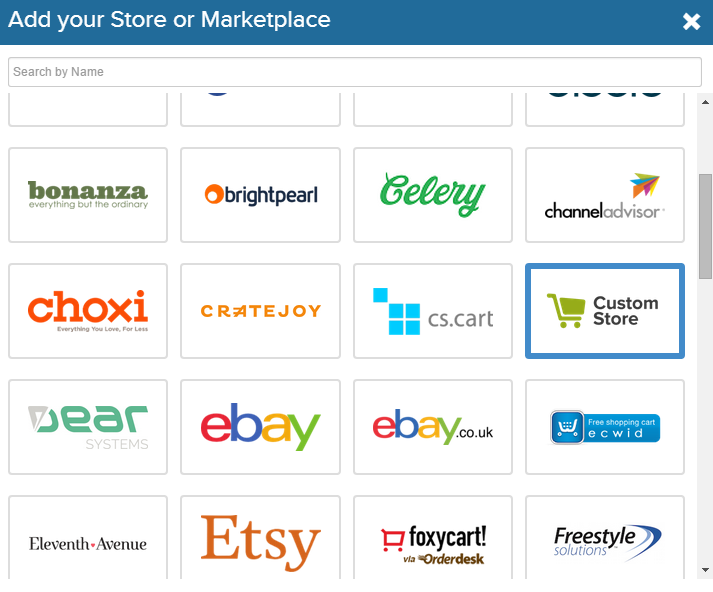
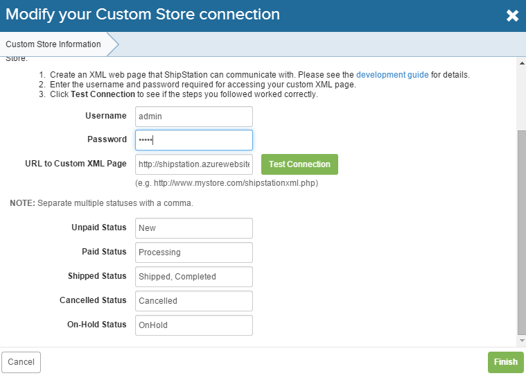
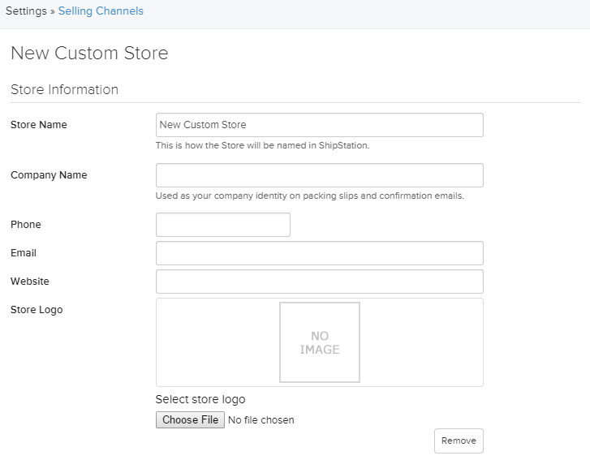

---
title: Working with shipments
description: The article about working with shipments in Virto Commerce
layout: docs
date: 2015-07-23T22:53:04.500Z
priority: 1
---
## Introduction

There are many things to do before the order becomes fulfilled and goes to completed status. <a class="crosslink" href="https://virtocommerce.com/shopping-cart" target="_blank">Order items</a> should be pick and packed with invoices, slips and labels printed. It should be shipped. The customer should confirm the package received.В There are services that provide such a functionality in complex. We created an integration module with ShipStation service. It allows to pass order and shipment information to ShipStation and get notifications on shipment status back to VirtoCommerce.

## Installation

To use ShipStation service you need first to install ShipStation integration module. Download the module from the VirtoCommerce AppStore and install it as any regular module. How to install module seeВ [link](docs/vc2userguide/configuration/modules-management).

## Configuration

There is no additional settings for ShipStation module in VirtoCommerce. All the setup is made in ShipStation. However user with WebApi client permissions should exist in VirtoCommerce store in order to authorize ShipStation requests.

To connect ShipStation with your VirtoCommerce deployment, follow the steps below:
* Login to your <a href="https://ss.shipstation.com/" rel="nofollow">ShipStation</a>В account.
* Click onВ **Account Settings**В from top right corner and then go to Selling Channels.
* Click on the button labeled asВ **Connect a store or marketplace**. Scroll down and select **Custom store**.

* Copy the below fields for "username", "password" and "URL" the custom store setup:
  * **Username**В - Enter username of VirtoCommerce user with WebApi permission.
  * **Password**В -В Enter password of VirtoCommerce user with WebApi permission.
  * **URL to custom XML page**В - URL to VirtoCommerce web manager added path to shipstation api - "/api/fulfillment/shipstation". Say your Web manager address is:В http://demo.virtocommerce.com/adminВ in that case url to shipstation api would beВ http://demo.virtocommerce.com/admin/api/fulfillment/shipstation  

* Click onВ **Test Connection**В to check whether all the details are entered correctly or not. Upon successful connection, you will receive an alert notifying thatВ **your marketplace connection was successful**.

* Enter the order statuses as mentioned below and click on **Next**:  
  * **Unpaid Status**- New
  * **Paid Status** - Processing
  * **Shipped Status** - Shipped, Completed
  * **Cancelled Status** - Cancelled
  * **On-Hold Status** - OnHold  

> If you have set different statuses to the orders in VirtoCommerce you should set the right statuses here as well.  

Set the settings related to your store.

* You can enter other details as per your requirements. After clicking onВ **Finish**.

As the result orders will now start importing into your Shipstation account from VirtoCommerce store and ship notifications from ShipStation will trigger appropriate status change on order and shipment in VirtoCommerce.
